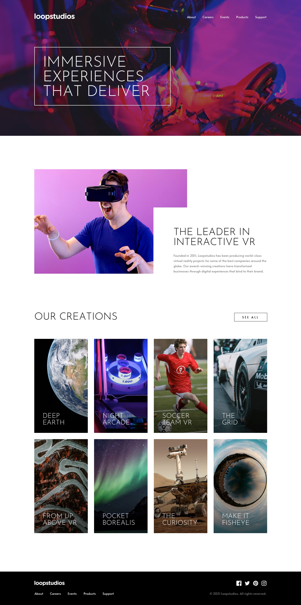
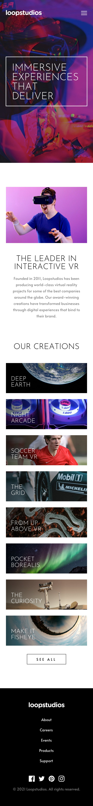

# Frontend Mentor - Loopstudios landing page

This is a solution to the [Loopstudios landing page challenge on Frontend Mentor](https://www.frontendmentor.io/challenges/loopstudios-landing-page-N88J5Onjw).

## Table of contents

- [Overview](#overview)
  - [Screenshot](#screenshot)
  - [Links](#links)
- [My process](#my-process)
  - [Built with](#built-with)
  - [What I learned](#what-i-learned)
  - [Continued development](#continued-development)
- [Author](#author)

---

## Overview

### Screenshot

|  |  |
| :--: | :--: |
| Desktop | Mobile |

### Links

- Solution URL: [Frontend Mentor](https://www.frontendmentor.io/solutions/loopstudios-landing-page-gk78iWF5hs)
- Live Site URL: [GitHub Pages](https://rahulpaul127.github.io/loopstudios-landing-page-main/)

---

## My process

### Built with

- Semantic HTML5 markup
- CSS custom properties (design tokens)
- CSS Flexbox & CSS Grid
- Mobile-first responsive workflow
- Vanilla JavaScript (for mobile menu)

### What I learned

- Implementing a **responsive CSS Grid** for the "Our Creations" section, transitioning from a single-column layout on mobile to a 4-column grid on desktop.
- Managing **aspect ratios** for the creation cards using the `aspect-ratio` CSS property (`aspect-ratio: 240 / 450` for desktop, `aspect-ratio: 343 / 120` for mobile) to ensure the images maintain their exact proportions regardless of screen size.
- Building an **interactive mobile navigation menu** with vanilla JavaScript. It handles opening a full-screen overlay, modifying `aria-expanded` attributes for accessibility, and explicitly locking the `body` scroll to prevent background scrolling when the menu is active.
- Enhancing **keyboard accessibility** by adding `tabindex="0"` to the creation cards and styling the `:focus` pseudo-class to match the mouse `:hover` states, ensuring the site is navigable for all users.
- Adding **Escape key support** to close the mobile navigation menu via a `keydown` event listener, improving the overall user experience and adhering to WCAG guidelines.
- Structuring a custom layout for the **interactive VR section**, utilizing relative and absolute positioning and negative margins (`margin-left: -170px`) to achieve the specific overlapping text panel effect seen in the design.
- Applying a CSS `linear-gradient` over images for text readability, and reversing the gradient colors and opacities smoothly on hover/focus.

### Continued development

- Add the deployed live links after publishing the project to GitHub Pages.
- Explore utilizing more advanced CSS container queries for component-based responsiveness.

## Author

- Frontend Mentor - [@rahulpaul12](https://www.frontendmentor.io/profile/rahulpaul127)
- Twitter - [@rahulpaul127](https://x.com/rahulpaul127)
